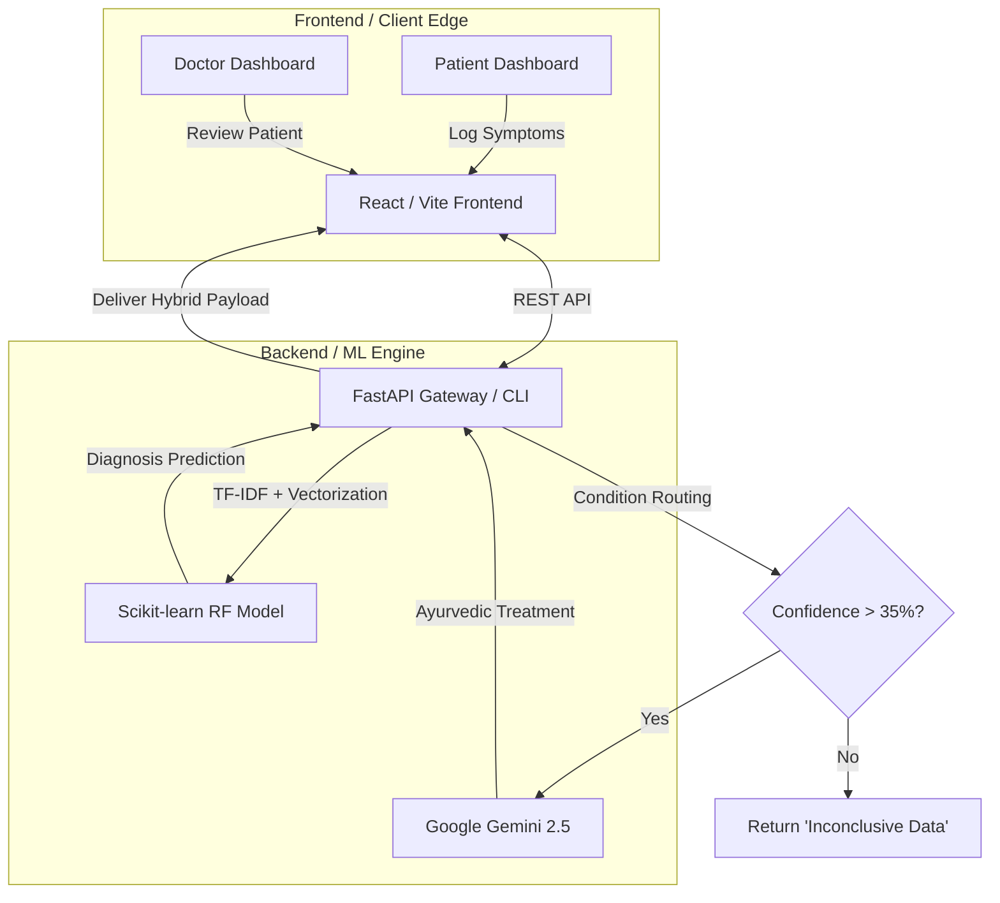

# 🌿 Arogya AI – Disease Prediction System with Ayurvedic Intelligence


ArogyaAI is a comprehensive Clinical Decision Support System (CDSS) that bridges the gap between traditional Ayurvedic medicine and modern Artificial Intelligence. It provides both accurate disease diagnosis and personalized Ayurvedic treatment recommendations.

By utilizing a **Dual-Engine AI Architecture** (Deterministic Machine Learning + Generative AI) and strict **Role-Based Access Control (RBAC)**, ArogyaAI provides a secure, end-to-end ecosystem for both patients and medical practitioners. The system can be run completely offline via command-line interface (CLI) or as a fully deployed cloud web platform.

---

## 🎯 The Problem & Solution
Traditional Ayurvedic diagnostics rely heavily on practitioner intuition, while modern medical AI models act as "black boxes" that ignore holistic factors like Doshas (Prakriti) and seasonality. Exposing raw, low-confidence ML predictions directly to patients poses a severe psychological risk.

**ArogyaAI solves this by:**
1. Combining mathematical Random Forest predictions (99%+ accuracy) with Generative LLM contextual reasoning.
2. Utilizing Explainable AI (XAI) so doctors can see *why* the AI made its decision.
3. Implementing strict Clinical Safety Guardrails that mask low-confidence predictions to prevent patient panic.

---

## 🚀 System Architecture & Flow



---

## ✨ Key Features & Model Performance

### 🧠 Dual-Engine AI & Analytics
* **High-Accuracy ML Model:** Over 99% accuracy using a Random Forest Classifier trained on 819 features (12 basic + 807 TF-IDF symptom NLP tokens).
* **SMOTE Class Balancing:** Up-sampled dataset from 4,201 to 20,748 samples for robust predictions across 399 potential diseases.
* **LLM Contextual Validation:** Evaluates symptoms against season, weather, and dosha using Gemini 2.5 Pro.

### 🌿 Ayurvedic Intelligence
* **Comprehensive Dosha Selection:** Detailed assessment supporting Vata, Pitta, Kapha, and mixed body constitutions.
* **Granular Treatment Plans:** Provides Sanskrit and English herb names, precise dietary recommendations, and Ayurvedic therapies (Abhyanga, Nasya, Panchakarma).

### 🔐 Full-Stack Web Platform
* **Role-Based Portals:** Secure Practitioner and Patient views with Clinic ID siloing.
* **Safety Guardrails:** Masks raw Western disease labels for patients, preferring comforting actionable lifestyle advice while keeping clinical diagnostics for the doctor.

---

## ⚙️ How to Run & Use the System

You can run ArogyaAI in two distinct modes: **Web Mode** (for full UI/UX) or **CLI Mode** (offline, terminal testing).

### 1. Initial Setup (Required for both modes)
```bash
git clone https://github.com/gaur-avvv/Arogya-AI.git
cd Arogya-AI
pip install -r requirements.txt
```
*(Optional)* Train the model if the `random_forest_model.pkl` is missing:
```bash
python train_model.py
```

### 💻 Mode A: Web Interface (Full-Stack)
Run the modern React + FastAPI ecosystem.

**Start the Backend (FastAPI):**
```bash
uvicorn backend.index:app --reload
# Runs on http://127.0.0.1:8000
```
**Start the Frontend (React):**
Open a new terminal:
```bash
cd frontend
npm install
npm run dev
# Runs on http://localhost:5173
```

### 🖥️ Mode B: CLI Assessment (Terminal)
For developers or offline scenarios wanting to talk directly to the model.
```bash
python arogya_predict.py
```
*Follow the interactive prompts to enter symptoms (e.g., "joint pain, morning stiffness"), age, dosha, etc., and get a brilliant console printout of your predicted disease and Ayurvedic protocol.*

---

## 🌐 Deployment Architecture (Vercel & Render)

Due to Vercel's 500MB serverless constraints and the heavy Scikit-Learn payload, this infrastructure is decoupled for the cloud:

1. **Frontend (Vercel):** The React `frontend` folder is individually deployed on Vercel. Set the environment variable `VITE_API_URL` to point to the secure Render backend.
2. **Backend (Render):** The FastAPI Python backend is deployed via Render using the configured `render.yaml` Blueprint. It effortlessly handles the heavy `numpy` and `pandas` memory footprints on a persistent web service.

---

## 📊 Sample CLI Output
```text
============================================================
AROGYA AI - Integrated ML + LLM Prediction System
============================================================
Enter your symptoms: joint pain, stiffness, swelling, difficulty walking
Enter your age: 52
Enter your general body type: Medium
...
   => ML Model Prediction: 'Arthritis' (Confidence: 96.50%)

🌿 Your Personalized Ayurvedic Plan

🩺 Condition Explained
Sandhivata (Arthritis) occurs when Vata dosha accumulates in the joints (Sandhi), causing pain, stiffness, and inflammation...

Ayurvedic Medicinal Herbs
- Sanskrit: Shallaki, Guggulu, Ashwagandha
- English: Boswellia, Indian Bdellium, Winter Cherry
- Effects: Anti-inflammatory, reduces joint pain

🥗 Dietary Recommendations
- Warm, cooked, and easily digestible foods
- Ghee, sesame oil, and healthy fats
```

---

## 📈 Detailed System Architecture & Performance

### End-to-End Pipeline
1. **Data Processing**: TF-IDF vectorization of symptoms (807 features)
2. **Feature Engineering**: 12 basic health features + 807 symptom features = 819 total features
3. **Class Balancing**: SMOTE applied for balanced training dataset (4,201 → 20,748 samples)
4. **Model Training**: Ensemble logic utilizing Random Forest alongside dynamic feature loading.
5. **LLM Analysis**: Live contextual generation mapping inference to traditional Sanskrit/English medicine databases.

### Model Accuracy
- **Random Forest Accuracy**: 1.0000 (100%)
- **Logistic Regression Accuracy**: 0.9964 (99.64%)
- **SVM Accuracy**: 0.9417 (94.17%)

---

## 🔬 Supported Medical Domains (399+ Diseases)
The robust deterministic logic maps accurately to over 399 unique conditions spanning categories like:
- **Infectious Diseases:** Dengue, Tuberculosis, Malaria, Hepatitis
- **Metabolic & Endocrine:** Diabetes, Hypertension, Thyroid, PCOS
- **Cardiovascular & Digestive:** Stroke, Heart Disease, Gastroenteritis, Peptic Ulcers
- **Neurological & Mental Health:** Migraine, Depression, Insomnia, Epilepsy
- **Musculoskeletal:** Arthritis, Spondylosis, Osteoporosis
- **And hundreds more!**

---

*👨‍💻 **Academic Integrity:** ArogyaAI is a prototype Clinical Decision Support System exhibiting full-stack engineering logic, robust backend integrations, and modern AI implementations. It is designed stringently to assist, not replace, licensed medical professionals.*
- Chronic Pain Syndromes

*The complete system supports 399+ diseases in total, with comprehensive Ayurvedic treatment recommendations for each condition.*

## Usage Modes

### 1. Demo Mode (Default)
Runs sample predictions with pre-defined test cases demonstrating the system capabilities.

### 2. Interactive Mode
Collects user symptoms and health information through an intuitive questionnaire:
- Symptoms input
- Age, height, weight
- Gender and age group
- Enhanced dosha selection with detailed descriptions
- Lifestyle factors (food habits, medication, allergies)
- Environmental factors (season, weather)

### 3. API Integration (Ready)
The system is designed to be easily integrated into web applications or APIs.

### 4. Offline Mode 🔌
**NEW**: The system now works completely offline when internet/LLM is unavailable:
- Automatic detection of LLM availability
- Graceful fallback to local Ayurvedic database
- Same ML prediction accuracy (100%)
- Comprehensive offline recommendations from 4,201+ disease database
- No API key required for basic operation
- Perfect for privacy-sensitive deployments

See [FALLBACK_MECHANISM.md](FALLBACK_MECHANISM.md) for detailed documentation.


## Technical Implementation

- **ML Framework**: Scikit-learn
- **Text Processing**: TF-IDF Vectorization
- **Class Balancing**: SMOTE (Synthetic Minority Oversampling)
- **Feature Scaling**: StandardScaler
- **Model Persistence**: Joblib
- **Data Processing**: Pandas, NumPy
- **Confidence Calibration**: Advanced prediction gap analysis

## File Structure

```
├── train_model.py           # Model training script
├── arogya_predict.py        # Main prediction system with interactive mode
├── disease_prediction_system.py  # Alternative comprehensive implementation
├── demo.py                  # Detailed system demonstration
├── test_fallback.py         # Fallback mechanism testing script
├── requirements.txt         # Python dependencies
├── random_forest_model.pkl  # Trained model (generated)
├── enhanced_ayurvedic_treatment_dataset.csv  # Comprehensive Ayurvedic treatment database (4,201+ diseases)
├── FALLBACK_MECHANISM.md    # Detailed offline mode documentation
└── AyurCore.ipynb          # Original research notebook
```

## Enhanced Ayurvedic Knowledge Base

The system includes an expanded database of traditional Ayurvedic treatments with:
- 50+ traditional herbs with Sanskrit and English names
- 30+ therapeutic treatments and procedures
- Dosha-specific recommendations for Vata, Pitta, and Kapha constitutions
- Personalized dietary guidelines
- Treatment effects explanation for different body types
- Advanced disease-to-treatment mapping with fallback options
- Dynamic treatment personalization based on body constitution

## Future Enhancements

- ~~Integration with real medical datasets~~ ✅ **DONE**
- ~~Enhanced confidence scoring~~ ✅ **DONE**
- ~~Interactive assessment mode~~ ✅ **DONE**
- ~~Top-5 predictions~~ ✅ **DONE**
- ~~Comprehensive dosha selection~~ ✅ **DONE**
- Web interface for easier access
- Mobile application
- Multi-language support
- Advanced NLP for symptom processing
- Telemedicine integration
- User authentication and history
- Dashboard for healthcare providers

## Disclaimer

This system is for educational and research purposes. Always consult with qualified healthcare professionals for medical advice and treatment.

---

**Stay healthy with the wisdom of Ayurveda! 🌿**
