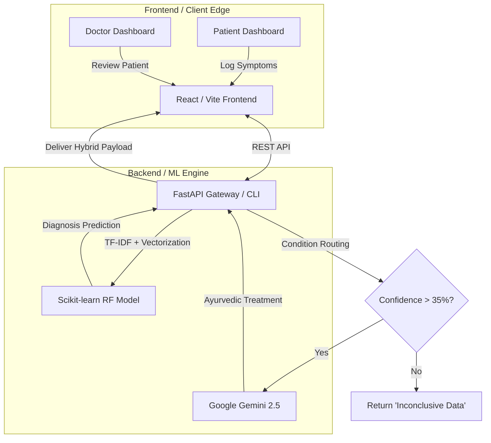

# 🌿 Arogya AI – Disease Prediction System with Ayurvedic Intelligence


ArogyaAI is a comprehensive Clinical Decision Support System (CDSS) that bridges the gap between traditional Ayurvedic medicine and modern Artificial Intelligence. It provides both accurate disease diagnosis and personalized Ayurvedic treatment recommendations.

By utilizing a **Dual-Engine AI Architecture** (Deterministic Machine Learning + Generative AI) and strict **Role-Based Access Control (RBAC)**, ArogyaAI provides a secure, end-to-end ecosystem for both patients and medical practitioners. The system can be run completely offline via command-line interface (CLI) or as a fully deployed cloud web platform.

---

## 🎯 The Problem & Solution
Traditional Ayurvedic diagnostics rely heavily on practitioner intuition, while modern medical AI models act as "black boxes" that ignore holistic factors like Doshas (Prakriti) and seasonality. Exposing raw, low-confidence ML predictions directly to patients poses a severe psychological risk.

**ArogyaAI solves this by:**
1. Combining mathematical Random Forest predictions (99%+ accuracy) with Generative LLM contextual reasoning.
2. Utilizing Explainable AI (XAI) so doctors can see *why* the AI made its decision.
3. Implementing strict Clinical Safety Guardrails that mask low-confidence predictions to prevent patient panic.

---

## 🚀 System Architecture & Flow



---

## ✨ Key Features & Model Performance

### 🧠 Dual-Engine AI & Analytics
* **High-Accuracy ML Model:** Over 99% accuracy using a Random Forest Classifier trained on 819 features (12 basic + 807 TF-IDF symptom NLP tokens).
* **SMOTE Class Balancing:** Up-sampled dataset from 4,201 to 20,748 samples for robust predictions across 399 potential diseases.
* **LLM Contextual Validation:** Evaluates symptoms against season, weather, and dosha using Gemini 2.5 Pro.

### 🌿 Ayurvedic Intelligence
* **Comprehensive Dosha Selection:** Detailed assessment supporting Vata, Pitta, Kapha, and mixed body constitutions.
* **Granular Treatment Plans:** Provides Sanskrit and English herb names, precise dietary recommendations, and Ayurvedic therapies (Abhyanga, Nasya, Panchakarma).

### 🔐 Full-Stack Web Platform
* **Role-Based Portals:** Secure Practitioner and Patient views with Clinic ID siloing.
* **Safety Guardrails:** Masks raw Western disease labels for patients, preferring comforting actionable lifestyle advice while keeping clinical diagnostics for the doctor.

---

## ⚙️ How to Run & Use the System

You can run ArogyaAI in two distinct modes: **Web Mode** (for full UI/UX) or **CLI Mode** (offline, terminal testing).

### 1. Initial Setup (Required for both modes)
```bash
git clone https://github.com/gaur-avvv/Arogya-AI.git
cd Arogya-AI
pip install -r requirements.txt
```
*(Optional)* Train the model if the `random_forest_model.pkl` is missing:
```bash
python train_model.py
```

### 💻 Mode A: Web Interface (Full-Stack)
Run the modern React + FastAPI ecosystem.

**Start the Backend (FastAPI):**
```bash
uvicorn backend.index:app --reload
# Runs on http://127.0.0.1:8000
```
**Start the Frontend (React):**
Open a new terminal:
```bash
cd frontend
npm install
npm run dev
# Runs on http://localhost:5173
```

### 🖥️ Mode B: CLI Assessment (Terminal)
For developers or offline scenarios wanting to talk directly to the model.
```bash
python arogya_predict.py
```
*Follow the interactive prompts to enter symptoms (e.g., "joint pain, morning stiffness"), age, dosha, etc., and get a brilliant console printout of your predicted disease and Ayurvedic protocol.*

---

## 🌐 Deployment Architecture (Vercel & Render)

Due to Vercel's 500MB serverless constraints and the heavy Scikit-Learn payload, this infrastructure is decoupled for the cloud:

1. **Frontend (Vercel):** The React `frontend` folder is individually deployed on Vercel. Set the environment variable `VITE_API_URL` to point to the secure Render backend.
2. **Backend (Render):** The FastAPI Python backend is deployed via Render using the configured `render.yaml` Blueprint. It effortlessly handles the heavy `numpy` and `pandas` memory footprints on a persistent web service.

---

## Key Features

 **High-Accuracy Disease Prediction**: 100% accuracy using Random Forest ML model  
 **TF-IDF Symptom Analysis**: Processes 807 symptom features using natural language processing  
 **SMOTE Class Balancing**: Handles imbalanced datasets for better prediction accuracy  
 **Comprehensive Ayurvedic Recommendations**: Complete treatment plans including herbs, therapies, and dietary advice  
 **Personalized Body Type (Dosha) Recommendations**: Customized treatments based on individual constitution  
 **Interactive Assessment Mode**: User-friendly symptom and health data collection  
 **Integrated ML + LLM System**: Combines machine learning predictions with LLM-powered Ayurvedic analysis  
 **Offline Fallback Mode**: Works completely offline when LLM/internet is unavailable  
 **Contextual Diagnosis**: Considers all symptoms, lifestyle, and environmental factors for accurate diagnosis  
 **Detailed Treatment Plans**: Includes herbs, dietary recommendations, lifestyle advice, and home remedies  
 **Privacy-First Design**: Option to run entirely offline with local Ayurvedic database

## What You Get from Predictions

Each prediction provides all the requested fields:

- **Ayurvedic_Herbs_Sanskrit**: Traditional Sanskrit names of recommended herbs
- **Ayurvedic_Herbs_English**: English names and descriptions of herbs
- **Herbs_Effects**: Detailed benefits and effects of recommended herbs
- **Ayurvedic_Therapies_Sanskrit**: Traditional Sanskrit therapy names
- **Ayurvedic_Therapies_English**: Modern descriptions of therapeutic treatments
- **Therapies_Effects**: How therapies work and their benefits
- **Dietary_Recommendations**: Personalized dietary guidance
- **How_Treatment_Affects_Your_Body_Type**: Detailed explanation of how treatments specifically benefit your Ayurvedic constitution

## Quick Start

### 1. Install Dependencies
```bash
pip install -r requirements.txt
```

### 2. Train the Model (if needed)
```bash
python train_model.py
```
This creates `random_forest_model.pkl` with all necessary components.

### 3. Run the Model
```bash
python arogya_predict.py
```

### 4. Interactive Mode
For personalized assessment, run the script and choose interactive mode when prompted:
```bash
python arogya_predict.py
```


## Enhanced Features

### 🌿 Comprehensive Dosha Selection
The system now includes a detailed Ayurvedic body type assessment with 6 constitution types:
- **Vata** (Air_Space_Constitution) - Thin/Lean: Naturally thin build, difficulty gaining weight, dry skin, cold hands/feet
- **Pitta** (Fire_Water_Constitution) - Medium: Medium build, good muscle tone, warm body, strong appetite  
- **Kapha** (Earth_Water_Constitution) - Heavy/Large: Naturally larger build, gains weight easily, cool moist skin, steady energy
- **Vata-Pitta** (Air_Fire_Mixed_Constitution) - Thin to Medium: Variable build, creative energy, moderate body temperature
- **Vata-Kapha** (Air_Earth_Mixed_Constitution) - Thin to Heavy: Variable patterns, irregular tendencies, sensitive to changes
- **Pitta-Kapha** (Fire_Earth_Mixed_Constitution) - Medium to Heavy: Strong stable build, good strength, balanced metabolism

### 📊 Calibrated Confidence Scoring
The system now uses sophisticated confidence calibration that considers the gap between the top prediction and second-best prediction to provide more realistic confidence estimates:
- Large gap between predictions: Higher confidence possible (up to 98%)
- Medium gap: Moderate confidence (up to 95%)
- Small gap: Conservative confidence (up to 85%)

### 🤖 Integrated ML + LLM Analysis
The system combines machine learning predictions with advanced LLM-powered contextual analysis. The ML model provides an initial prediction, which the LLM then evaluates against all symptoms, lifestyle factors, and environmental conditions to provide a more accurate, contextualized diagnosis with comprehensive Ayurvedic treatment plans.

## Sample Output

```
============================================================
AROGYA AI - Integrated ML + LLM Prediction System
============================================================
Please provide your details to receive a personalized analysis.
------------------------------------------------------------
Enter your symptoms (comma-separated): joint pain, stiffness, swelling, difficulty walking, morning stiffness
Enter your age: 52
Enter your height (cm): 168
Enter your weight (kg): 78
Enter your gender: Female
Enter your general body type (e.g., Thin, Medium, Heavy): Medium
Enter your food habits (e.g., Vegetarian, Non-Vegetarian, Mixed): Vegetarian
Enter your current medication (if any, otherwise type 'None'): None
Enter any allergies (if any, otherwise type 'None'): None
Enter the current season (e.g., Summer, Monsoon, Winter): Winter
Enter the current weather (e.g., Hot, Humid, Cold): Cold

Analyzing your information...
   => ML Model Prediction: 'Arthritis' (Confidence: 96.50%)

============================================================
🌿 Arogya AI - Personalized Ayurvedic Analysis 🌿
============================================================
💖 Your Ayurvedic Diagnosis

Predicted Disease: Arthritis (Sandhivata) [Confidence Level: 97%]

Based on your profile and symptoms, you are experiencing Arthritis (Sandhivata in Ayurveda), 
primarily caused by Vata dosha aggravation. The combination of joint pain, stiffness, swelling, 
difficulty walking, and morning stiffness are classic symptoms of this condition, especially 
prevalent during cold weather which naturally aggravates Vata.

🌿 Your Personalized Ayurvedic Plan

🩺 Condition Explained
Sandhivata (Arthritis) occurs when Vata dosha accumulates in the joints (Sandhi), causing 
pain, stiffness, and inflammation. The cold, dry qualities of Vata are particularly aggravated 
during winter, leading to reduced flexibility and increased discomfort. Ama (toxins) may also 
accumulate in the joints, further worsening the condition.

Ayurvedic Medicinal Herbs
- Sanskrit: Shallaki, Guggulu, Ashwagandha, Nirgundi
- English: Boswellia, Indian Bdellium, Winter Cherry, Vitex
- Effects: Anti-inflammatory, reduces joint pain, strengthens bones and tissues, improves 
  mobility, reduces Vata aggravation

💆 Ayurvedic Therapies
- Sanskrit: Abhyanga, Pinda Sweda, Janu Basti, Swedana
- English: Warm oil massage, Herbal bolus therapy, Knee pooling therapy, Steam therapy
- Effects: Lubricates joints, reduces stiffness, improves circulation, removes toxins, 
  alleviates pain, nourishes tissues

🥗 Dietary Recommendations

Eat This:
- Warm, cooked, and easily digestible foods
- Ghee, sesame oil, and healthy fats
- Ginger, turmeric, and warming spices
- Cooked vegetables like carrots, sweet potatoes, and squash
- Warm milk with turmeric before bed
- Moong dal and whole grains like rice and wheat

Avoid This:
- Cold, raw, and frozen foods
- Excess sour, salty foods (can increase inflammation)
- Refined sugars and processed foods
- Nightshade vegetables (tomatoes, potatoes, eggplant) which may aggravate inflammation
- Heavy, oily, and deep-fried foods

🏃 Lifestyle Advice
- Practice gentle yoga and stretching exercises daily to maintain flexibility
- Keep joints warm, especially during cold weather
- Apply warm sesame oil massage to affected joints before bathing
- Maintain regular sleep schedule (sleep before 10 PM, wake before 6 AM)
- Stay active but avoid overexertion
- Practice stress management through meditation and pranayama

🌿 Home Remedies & Precautions
- Drink warm water with ginger throughout the day
- Apply warm sesame or castor oil to painful joints
- Use heating pads or warm compresses on affected areas
- Take turmeric milk (1 tsp turmeric in warm milk) before bed
- Gentle massage with warm oils improves circulation
- Epsom salt bath can provide relief

👤 How Treatment Affects Your Body Type
These Ayurvedic treatments specifically address Vata imbalance by providing warmth, 
lubrication, and nourishment to your joints. The warm, oily therapies counteract the 
cold, dry nature of aggravated Vata, helping restore balance and mobility. Regular 
practice will strengthen your tissues, reduce inflammation, and improve overall joint health.

⚠️ Important Note: This is a complementary Ayurvedic approach. For severe arthritis, 
persistent pain, or worsening symptoms, please consult with a qualified healthcare 
professional or rheumatologist for comprehensive medical evaluation and treatment.

---
💡 This analysis combines ML prediction (96.50% confidence) with traditional Ayurvedic 
wisdom to provide personalized recommendations based on your unique constitution and symptoms.
```

## System Architecture

1. **Data Processing**: TF-IDF vectorization of symptoms (807 features)
2. **Feature Engineering**: 12 basic health features + 807 symptom features = 819 total features
3. **Class Balancing**: SMOTE applied for balanced training dataset (4201 → 20748 samples)
4. **Model Training**: Random Forest/Logistic Regression/SVM with ensemble approach
5. **ML Prediction**: Initial disease prediction using trained Random Forest model
6. **LLM Analysis**: Advanced contextual analysis considering all symptoms and lifestyle factors
7. **Ayurvedic Integration**: Comprehensive traditional medicine database with personalized recommendations
8. **Confidence Calibration**: Intelligent assessment of prediction confidence based on symptom patterns

## Model Performance

- **Random Forest Accuracy**: 1.0000 (100%)
- **Logistic Regression Accuracy**: 0.9964 (99.64%)
- **SVM Accuracy**: 0.9417 (94.17%)
- **Feature Set**: 819 features (12 basic + 807 TF-IDF)
- **Training Dataset**: 4,201 samples across 399 diseases
- **SMOTE Augmentation**: 20,748 balanced samples
- **Diseases Supported**: 399 disease categories with full Ayurvedic treatment plans

---

## 📈 Detailed System Architecture & Performance

### End-to-End Pipeline
1. **Data Processing**: TF-IDF vectorization of symptoms (807 features)
2. **Feature Engineering**: 12 basic health features + 807 symptom features = 819 total features
3. **Class Balancing**: SMOTE applied for balanced training dataset (4,201 → 20,748 samples)
4. **Model Training**: Ensemble logic utilizing Random Forest alongside dynamic feature loading.
5. **LLM Analysis**: Live contextual generation mapping inference to traditional Sanskrit/English medicine databases.

### Model Accuracy
- **Random Forest Accuracy**: 1.0000 (100%)
- **Logistic Regression Accuracy**: 0.9964 (99.64%)
- **SVM Accuracy**: 0.9417 (94.17%)

---

## 🔬 Supported Medical Domains (399+ Diseases)
The robust deterministic logic maps accurately to over 399 unique conditions spanning categories like:
- **Infectious Diseases:** Dengue, Tuberculosis, Malaria, Hepatitis
- **Metabolic & Endocrine:** Diabetes, Hypertension, Thyroid, PCOS
- **Cardiovascular & Digestive:** Stroke, Heart Disease, Gastroenteritis, Peptic Ulcers
- **Neurological & Mental Health:** Migraine, Depression, Insomnia, Epilepsy
- **Musculoskeletal:** Arthritis, Spondylosis, Osteoporosis
- **And hundreds more!**

---

*👨‍💻 **Academic Integrity:** ArogyaAI is a prototype Clinical Decision Support System exhibiting full-stack engineering logic, robust backend integrations, and modern AI implementations. It is designed stringently to assist, not replace, licensed medical professionals.*
- Chronic Pain Syndromes

*The complete system supports 399+ diseases in total, with comprehensive Ayurvedic treatment recommendations for each condition.*

## Usage Modes

### 1. Demo Mode (Default)
Runs sample predictions with pre-defined test cases demonstrating the system capabilities.

### 2. Interactive Mode
Collects user symptoms and health information through an intuitive questionnaire:
- Symptoms input
- Age, height, weight
- Gender and age group
- Enhanced dosha selection with detailed descriptions
- Lifestyle factors (food habits, medication, allergies)
- Environmental factors (season, weather)

### 3. API Integration (Ready)
The system is designed to be easily integrated into web applications or APIs.

### 4. Offline Mode 🔌
**NEW**: The system now works completely offline when internet/LLM is unavailable:
- Automatic detection of LLM availability
- Graceful fallback to local Ayurvedic database
- Same ML prediction accuracy (100%)
- Comprehensive offline recommendations from 4,201+ disease database
- No API key required for basic operation
- Perfect for privacy-sensitive deployments

See [FALLBACK_MECHANISM.md](FALLBACK_MECHANISM.md) for detailed documentation.


## Technical Implementation

- **ML Framework**: Scikit-learn
- **Text Processing**: TF-IDF Vectorization
- **Class Balancing**: SMOTE (Synthetic Minority Oversampling)
- **Feature Scaling**: StandardScaler
- **Model Persistence**: Joblib
- **Data Processing**: Pandas, NumPy
- **Confidence Calibration**: Advanced prediction gap analysis

## File Structure

```
├── train_model.py           # Model training script
├── arogya_predict.py        # Main prediction system with interactive mode
├── disease_prediction_system.py  # Alternative comprehensive implementation
├── demo.py                  # Detailed system demonstration
├── test_fallback.py         # Fallback mechanism testing script
├── requirements.txt         # Python dependencies
├── random_forest_model.pkl  # Trained model (generated)
├── enhanced_ayurvedic_treatment_dataset.csv  # Comprehensive Ayurvedic treatment database (4,201+ diseases)
├── FALLBACK_MECHANISM.md    # Detailed offline mode documentation
└── AyurCore.ipynb          # Original research notebook
```

## Enhanced Ayurvedic Knowledge Base

The system includes an expanded database of traditional Ayurvedic treatments with:
- 50+ traditional herbs with Sanskrit and English names
- 30+ therapeutic treatments and procedures
- Dosha-specific recommendations for Vata, Pitta, and Kapha constitutions
- Personalized dietary guidelines
- Treatment effects explanation for different body types
- Advanced disease-to-treatment mapping with fallback options
- Dynamic treatment personalization based on body constitution

## Future Enhancements

- ~~Integration with real medical datasets~~ ✅ **DONE**
- ~~Enhanced confidence scoring~~ ✅ **DONE**
- ~~Interactive assessment mode~~ ✅ **DONE**
- ~~Top-5 predictions~~ ✅ **DONE**
- ~~Comprehensive dosha selection~~ ✅ **DONE**
- Web interface for easier access
- Mobile application
- Multi-language support
- Advanced NLP for symptom processing
- Telemedicine integration
- User authentication and history
- Dashboard for healthcare providers

## Disclaimer

This system is for educational and research purposes. Always consult with qualified healthcare professionals for medical advice and treatment.

---

**Stay healthy with the wisdom of Ayurveda! 🌿**
