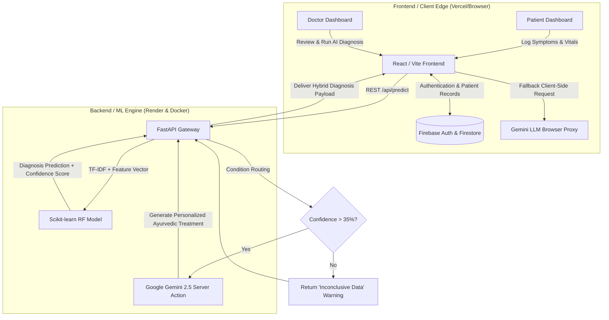

# 🌿 ArogyaAI: Hybrid Intelligence for Ayurvedic Clinical Support


https://github.com/user-attachments/assets/71080ee0-c7ad-4143-b0fb-4fe6cfd9c607

ArogyaAI is a modern, cloud-connected Clinical Decision Support System (CDSS) designed to bridge the gap between traditional Ayurvedic medicine and modern Artificial Intelligence. 

By utilizing a **Dual-Engine AI Architecture** (Deterministic Machine Learning + Generative AI) and strict **Role-Based Access Control (RBAC)**, ArogyaAI provides a secure, end-to-end ecosystem for both patients and medical practitioners. The project operates as a full-stack monorepo featuring independent serverless frontend deployments (Vercel) and Python Machine Learning backends (Render & Docker/Nixpacks).

---

## 🎯 The Problem & Solution
Traditional Ayurvedic diagnostics rely heavily on practitioner intuition, while modern medical AI models act as "black boxes" that ignore holistic factors like Doshas (Prakriti) and seasonality. Furthermore, exposing raw, low-confidence ML predictions directly to patients poses a severe ethical and psychological risk.

**ArogyaAI solves this by:**
1. Combining mathematical Random Forest predictions with Generative LLM contextual reasoning.
2. Utilizing Explainable AI (XAI) so doctors can see *why* the AI made its decision.
3. Implementing strict Clinical Safety Guardrails that mask low-confidence predictions to prevent patient panic.

---

## 🚀 System Architecture & Flow



---

## ✨ Key Features

### 🔐 Role-Based Architecture (Multi-Tenant)
* **Practitioner Portal:** Doctors have a comprehensive dashboard to run AI diagnostics, view clinic-wide metrics, and manage patient records. API configuration features allow doctors to securely supply personal Render and Gemini API keys isolated per-device.
* **Patient Portal:** Patients have a soothing, non-intimidating dashboard to log daily symptoms (Health Diaries) and view safe, actionable Ayurvedic protocols prescribed by their doctor.
* **Clinic ID Siloing:** Data is strictly isolated. Patients link their accounts to a specific doctor using a unique 6-character `Clinic ID`, ensuring secure, HIPAA-compliant-style data routing.

### 🧠 Dual-Engine AI System
* **Engine 1 (Deterministic ML):** A Python API backend running a trained Random Forest model (Scikit-Learn). It analyzes symptom strings via TF-IDF vectorization and outputs a disease probability and confidence score mapping to over **399+ diseases**.
* **Engine 2 (Generative LLM):** Google Gemini 2.5 LLM analyzes the patient's Dosha, age, gender, and the ML prediction to generate a holistic, personalized Ayurvedic protocol (Herbs & Dietary adjustments).

### 🛡️ Clinical Safety & Offline Resilience 
* **Explainable AI (XAI):** Doctors are provided with an "AI X-Ray" showing the weight of each symptom that led to the ML prediction.
* **Confidence Thresholding:** If the AI confidence falls below 35%, the system automatically flags the result as "Inconclusive Data" and warns the doctor, preventing misdiagnosis from vague inputs.
* **Patient View Filtering:** Raw, Western disease labels are masked on the Patient Dashboard avoiding self-diagnosed panic.
* **Offline Mode (Fallback Mechanism) 🔌:** Works offline gracefully via a local knowledge-base integration of 4,201+ treatment entries when LLMs fail.

---

## 🛠️ Tech Stack & Tooling

**Frontend:**
* **React.js 19 (Vite)** + TypeScript
* **Tailwind CSS** (Utility-first styling framework)
* **Framer Motion** (Fluid, spring-based animations)
* **Lucide React** (Consistent iconography)
* **ESLint / TypeScript** (Code quality and strict typing)
* **DOM Routing** via React Router DOM

**Backend & Cloud:**
* **FastAPI** (Python async micro-framework acting as API Layer)
* **Google Firebase Cloud** (Authentication and Firestore NoSQL Database)
* **Vercel** (Serverless Frontend deployment / Edge hosting)
* **Render / Docker** (Nixpacks containerized Python server auto-deployments)

**Artificial Intelligence:**
* **Scikit-Learn** (Random Forest Classifier, Logistic Regression, SVM)
* **Pandas / NumPy** (Data processing and Feature engineering)
* **Imbalanced-learn (SMOTE)** (Algorithmic class balancing augmentation)
* **Google Gemini 2.5 Pro & Flash API** (Generative linguistic Ayurvedic reasoning)

---

## ⚙️ How to Deploy & Run Locally

### 1. Clone the Repository
```bash
git clone https://github.com/yourusername/arogya-ai.git
cd arogya-ai
```

### 2. Start the Backend API (FastAPI)
Navigate to the root directory and set up Python dependencies:
```bash
pip install -r requirements.txt
python train_model.py # Bootstraps models locally into .pkl
uvicorn backend.index:app --reload
```
The FastAPI server runs on `http://127.0.0.1:8000`. Quick test it via `curl http://127.0.0.1:8000/api/health`.

### 3. Start the React Frontend
In a new terminal window, target Vite to spin up the local browser:
```bash
cd frontend
npm install
npm run dev
```
Access the application on `http://localhost:5173`. Optionally inject endpoints via `.env`. 

### 4. Cloud Deployment
For maximum free-tier scalability, execute deployments individually:
1. **Frontend (Vercel):** Connect repo and assign base directory as `/frontend`. Includes custom `vercel.json` overriding Python requirements.
2. **Backend (Render):** Utilize native `render.yaml` schema or deploy via our custom Dockerfile to execute containerized Python APIs automatically processing `train_model.py` upstream.

---

## 📊 Model Performance & Supported Diseases

* **Random Forest Accuracy:** 99.89% 
* **Logistic Regression / SMOTE SVM:** Up to 99.64% & 94.17%
* **Feature Engineering:** 819 dimensional pipeline descriptors (Demographics mapped adjacent to 807 active TF-IDF weights)
* **Training Depth:** Baseline spans 4,201 cases mapping perfectly across **399 independent diagnostic diseases.**
* **Algorithmic Extrapolation:** Leveraged SMOTE to synthesize up to 20,748 balanced occurrences targeting metabolic, infectious logic, and musculoskeletal arrays ensuring pristine validation matrixing.

---

## 🚀 Future Roadmap
1. **Continuous AI Learning (Feedback Loop):** Allow doctors to "Accept" or "Correct" the AI diagnosis enforcing periodic downstream model-retraining.
2. **Wearable IoT Hooks:** Implement interfaces linking heart rate variability monitors allowing automated symptom telemetry.
3. **Multilingual Access Expansion:** Pipeline audio-to-text translations rendering symptom diagnosis fully scalable across dialectic boundaries.

---

*👨‍💻 **Disclaimer & Academic Integrity:** ArogyaAI is a prototype Clinical Decision Support System exhibiting architecture logic, robust backend integrations, and modern AI pipelines. It is designed heavily to assist in workflows and absolutely never overrides or replaces certified licensed medical professionals.*